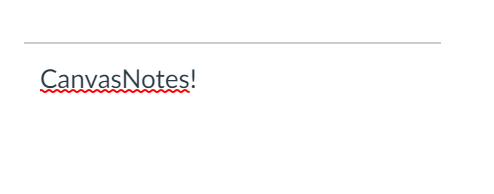
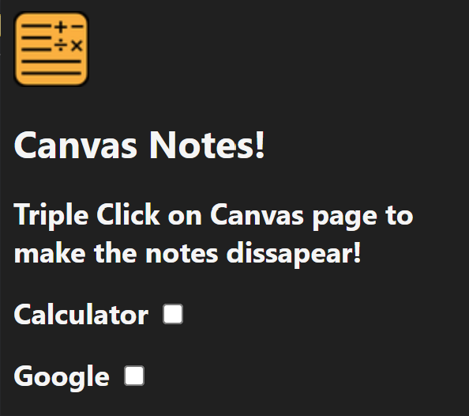

# Canvas Notes
> Injects a look-alike widget into the canvas page, triple click to make it disappear.

## [Todo](todo.md)

## Screenshots

<br>
<br>



## Image resizing Utility
`icons.py` is used to resize an icon named `icon128.png` of dimensions 128x128
usage is 
```console
python icons.py icons_dir/icon128.png
```

will output the same image in the sizes specified in `image_sizes` in the same directory